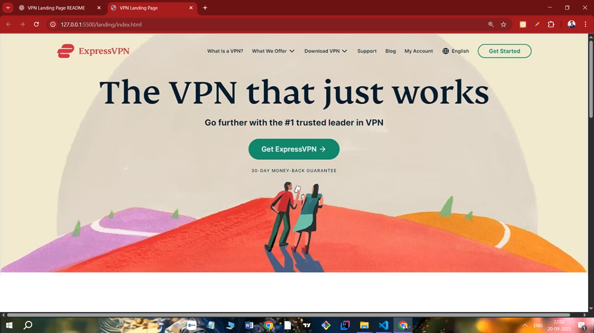

# OASIS-INFOBYTE 
# 🌟 My Frontend Projects Collection

Welcome to my frontend projects portfolio! This repository showcases three different projects I have built: a **VPN Landing Page**, a **Personal Portfolio Website**, and a **Temperature Converter Web App**. Each project focuses on clean design, responsiveness, and modern frontend practices.

---

## Table of Contents
1. [VPN Landing Page](#vpn-landing-page)
2. [Portfolio Website](#portfolio-website)
3. [Temperature Converter Website](#temperature-converter-website)
4. [Technologies Used](#technologies-used)
5. [Contact](#contact)

---

## 1️⃣ VPN Landing Page

A responsive VPN landing page inspired by ExpressVPN, designed to showcase product features, security, and global reach.

### Features
- Fully responsive hero and sections
- Showcases secure access, device compatibility, and fast connectivity
- Features list and server statistics
- Clean modern layout with image-based sections
- Call-to-action buttons throughout

### Screenshots


##2️⃣ Portfolio Website
#### A modern personal portfolio website built to showcase my skills, projects, resume, and contact details.

## Features
Responsive navbar with smooth scroll

Hero section with profile picture and intro

About, Projects, Resume, and Contact sections

Projects displayed in cards with hover effects

Downloadable resume

Scroll animations for smooth experience

Screenshots


##3️⃣ Temperature Converter Website
A clean and interactive temperature converter web app that converts between Celsius, Fahrenheit, and Kelvin.

## Features
Simple and intuitive UI

Responsive layout for mobile and desktop

Error handling for invalid input

Smooth animations for result display

Supports Celsius ↔ Fahrenheit ↔ Kelvin conversions

Screenshots


## 🛠 Technologies Used
```
Project	Technologies
VPN Landing Page	HTML5, CSS3, Flexbox, Responsive Design, Media Queries
Portfolio Website	HTML5, CSS3, JavaScript, Scroll Animations, Responsive Design
Temperature Converter	HTML5, CSS3, JavaScript, DOM Manipulation, Event Handling
```

### 📂 Folder Structure
```
bash
Copy code
/project-root
  /images
    vpn_hero.png
    vpn_secure.png
    vpn_devices.png
    vpn_features.png
    vpn_servers.png
    portfolio_hero.png
    portfolio_about.png
    portfolio_projects.png
    portfolio_resume.png
    portfolio_contact.png
    temperature_converter.png
    temperature_converter_result.png
  /vpn
    index.html
    style.css
  /portfolio
    index.html
    index.css
    script.js
  /temperature-converter
    index.html
```
## 📌 Contact
If you’d like to connect or discuss any project:

Email: vermaaditi084@gmail.com

Phone: +91 9876543210

Location: Kanpur, India

Built with ❤️ using HTML, CSS, and JavaScript.

yaml
Copy code

---

If you want, I can also **add live preview GIFs for each task** in the README for a more interactive and professional look.  


Do you want me to do that next?

